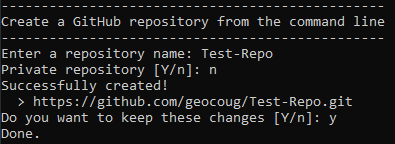

# create-github-repo

Simple CLI to initialize repos on GitHub using Python.

## Usage

`python create_repo.py`

**Or**

`docker build -t create-repo .`

`docker run --rm -it create-repo`

## Example

